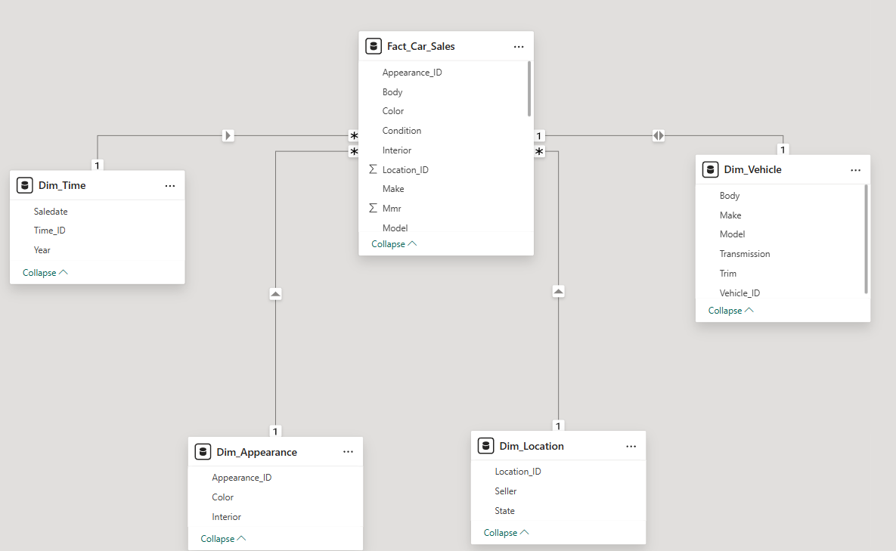
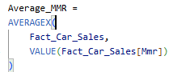
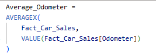
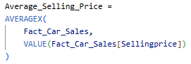
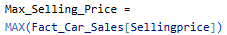
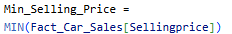
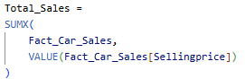
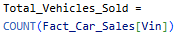

# 🚘 VEHICLE SALES ANALYTICS DASHBOARD

### 📊 Power BI Business Intelligence Project

  

## 🚗 Overview of Vehicle Sales Performance Using Power BI

A complete Business Intelligence dashboard project focused on:
Vehicle Sales Analysis, Data Cleaning, Exploratory Data Analysis (EDA), Star Schema Modeling, KPI Visualization, and Business Insights.

---

# 📌 PROJECT OVERVIEW

This project analyzes a real-world vehicle sales dataset using **Microsoft Power BI Desktop**.  
The goal of the project is to transform raw vehicle transaction data into a professional and interactive dashboard that provides valuable business insights.

The dashboard helps analyze:

✅ Vehicle sales performance  
✅ Brand performance  
✅ Seller and location analysis  
✅ Pricing analysis  
✅ Mileage trends  
✅ Vehicle body type distribution  
✅ Time-based sales trends  

---

# 🖼 DASHBOARD PREVIEW
>📌 Upload your dashboard screenshot to GitHub and replace the image link below.

---

# 🧩 DASHBOARD WIREFRAME DESIGN

> Upload your dashboard wireframe screenshot and name it exactly: `DASHBOARD_WIREFRAME.png`

---

# 🛠 TOOLS & TECHNOLOGIES USED

| Tool | Purpose |
|---|---|
| Microsoft Power BI | Dashboard Development |
| Power Query | Data Cleaning & Transformation |
| DAX | KPI Measures & Calculations |
| CSV Dataset | Data Source |
| GitHub | Documentation & Version Control |

---

# 📂 DATASET INFORMATION

| Requirement | Description |
|---|---|
| Dataset Name | Vehicle Sales / Car Prices Dataset |
| Dataset Source | Kaggle |
| Dataset Type | Real-world Dataset |
| File Format | CSV |
| Total Records | 558,837 Rows |
| Main Fact Table | Fact_Car_Sales |

---

# 🔗 PROJECT FILES & RAW DATASET LINKS

| File | Description | Link |
|---|---|---|
| FINAL_ANALYTICS_PROJECT.pbix | Final Power BI project file | [Open File](FINAL_ANALYTICS_PROJECT.pbix) |
| car_prices.csv | Raw vehicle sales dataset | [Open Raw Dataset](car_prices.csv) |
| Cleaned_Car_Prices.csv | Cleaned vehicle sales dataset | [Open Cleaned Dataset](Cleaned_Car_Prices.csv) |

---

# 🧹 DATA PREPROCESSING  
## CLEAN FRAMEWORK IMPLEMENTATION

The dataset was cleaned and prepared before dashboard development.

---

## ✅ C — Correct Inconsistencies

- andardized seller names
- eaned text formatting
- nverted abbreviations into readable formats
- rrected inconsistent state names

### Example:
-  → Florida
-  → California

---

## ✅ L — Locate Missing Values

- ecked for blank and null values
- placed missing values using readable placeholders

### Example:
- ll → "-"

---

## ✅ E — Eliminate Duplicates

- moved duplicate dimension records
- eserved important transactional records in the fact table

---

## ✅ A — Adjust Data

- rmatted dates properly
- justed numerical formats
- proved readability of values

### Example:
- nuary 29, 2015, 4:30 a.m. PST

---

## ✅ N — Normalize & Finalize

- eated clean dimension tables
- nalized Star Schema structure
- andardized naming conventions

---

# 🏗 DATA MODELING  
## STAR SCHEMA IMPLEMENTATION

The project follows a **Star Schema** data model for better performance and scalability.

---

## ⭐ FACT TABLE

### Fact_Car_Sales

Contains:
- hicle transactions
- lling price
- R
- ometer
- ndition
- le date
- reign keys

---

## ⭐ DIMENSION TABLES

| Dimension Table | Purpose |
|---|---|
| Dim_Vehicle_PQ | Vehicle details |
| Dim_Location_PQ | Seller & state information |
| Dim_Appearance_PQ | Color & interior details |
| Dim_Time_PQ | Date and year analysis |

---

# 🔑 SURROGATE PRIMARY KEYS

To support proper table relationships, surrogate primary keys were created in Power Query.

### Example Keys:
- hicle_ID
- cation_ID
- pearance_ID
- me_ID

These keys were merged back into the fact table to establish relationships between dimensions and transactional data.

---

# 📈 EXPLORATORY DATA ANALYSIS (EDA)

The project follows the **PYRAMID FRAMEWORK** by organizing the dashboard into:

1. Key Metrics
2. Supporting Analysis
3. Detailed Analysis

---

# 📊 KPI MEASURES

| KPI Measure | Purpose |
|---|---|
| Total Sales | Overall revenue |
| Total Vehicles Sold | Number of vehicles sold |
| Average Selling Price | Average selling value |
| Average MMR | Average market value |
| Average Odometer | Average mileage |
| Max Selling Price | Highest vehicle sale |
| Min Selling Price | Lowest vehicle sale |

---
---

# 🧮 DAX FORMULAS USED IN POWER BI

# 📉 VISUALIZATIONS USED

✅ KPI Cards  
✅ Bar Charts  
✅ Line Graphs  
✅ Donut Charts  
✅ Map Visuals  
✅ Table Visuals  
✅ Interactive Slicers  

---

# 🎨 DASHBOARD DESIGN  
## DASH FRAMEWORK IMPLEMENTATION

The dashboard was designed using the **DASH Framework**.

---

## 🎯 D — Define the Goal

The dashboard answers:
> “ow are vehicle sales performing across brands, states, body types, and time?”

---

## 🧩 A — Arrange the Layout

Dashboard sections were organized into:
- K Area
- Alysis Area
- Dailed Table Area
- Ieractive Filter Area

---

## 📊 S — Show the Right Visuals

The dashboard includes:
- Cds
- Crts
- Ms
- Tles
- Fters

---

## 💡 H — Highlight Insights

The dashboard highlights:
- Bt-selling brands
- Ses trends
- Rional sales performance
- Vicle distribution
- Sler analysis

---

# 💡 INSIGHTS & RECOMMENDATIONS

---

## 🚗 1. Ford Generated the Highest Sales

### Insight:
Ford appears as the top-performing vehicle brand.

### Recommendation:
Increase Ford inventory and analyze high-performing Ford models.

---

## 💰 2. Selling Prices Are Slightly Lower Than MMR

### Insight:
Average Selling Price is lower than Average MMR.

### Recommendation:
Review pricing strategies to improve profit margins.

---

## 🛣 3. Vehicles Have High Average Mileage

### Insight:
Average odometer reading is high.

### Recommendation:
Segment vehicles based on mileage ranges for targeted marketing.

---

## 🚙 4. Sedan and SUV Dominate the Market

### Insight:
Sedan and SUV body types dominate vehicle sales.

### Recommendation:
Focus inventory and promotions on high-demand body types.

---

## 🌎 5. Sales Performance Varies by State

### Insight:
Some states and sellers outperform others.

### Recommendation:
Analyze high-performing regions and optimize regional inventory distribution.

---

# 🌍 REAL-WORLD BUSINESS INTERPRETATION

This dashboard can help:
- Vicle dealerships
- Ao auction companies
- C resale businesses

make better decisions regarding:
- Ientory management
- Pcing strategies
- Sler evaluation
- Ses forecasting
- Rional sales optimization

---

# 👨‍💻 PROJECT DEVELOPER

# 🚀 DELA ROSA, KENT KHERWIN | CONCEPCION, JUSTINE | QUIROZ, BENEDICT | LUMANOG, PAULO | PINTOR, EDRICK JOHN

### Vehicle Sales Analytics Dashboard Project

📊 Microsoft Power BI Developer  
📈 Data Analytics Enthusiast  
🚗 Business Intelligence Project

---

# ⭐ PROJECT STATUS

✅ Data Collection Completed  
✅ Data Cleaning Completed  
✅ Star Schema Completed  
✅ Dashboard Completed  
✅ KPI Measures Completed  
✅ Insights & Recommendations Completed  

---

# 🌟 THANK YOU FOR VIEWING THIS PROJECT 🌟

