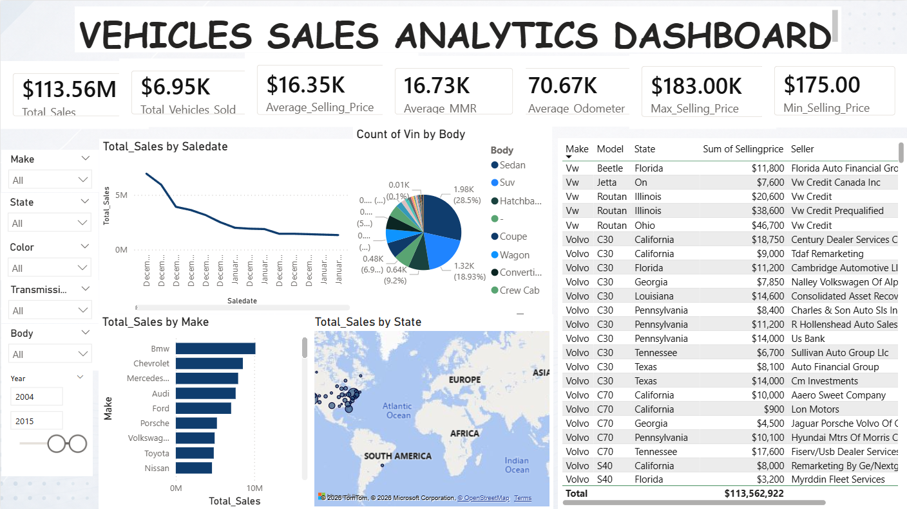

<div align="center">

# 🚘 VEHICLE SALES ANALYTICS DASHBOARD

### 📊 Power BI Business Intelligence Project


<br><br>

## 🚗 Overview of Vehicle Sales Performance Using Power BI

A complete Business Intelligence dashboard project focused on:
Vehicle Sales Analysis, Data Cleaning, Exploratory Data Analysis (EDA), Star Schema Modeling, KPI Visualization, and Business Insights.

</div>

---

# 📌 PROJECT OVERVIEW

This project analyzes a real-world vehicle sales dataset using **Microsoft Power BI Desktop**.  
The goal of the project is to transform raw vehicle transaction data into a professional and interactive dashboard that provides valuable business insights.

The dashboard helps analyze:

✅ Vehicle sales performance  
✅ Brand performance  
✅ Seller and location analysis  
✅ Pricing analysis  
✅ Mileage trends  
✅ Vehicle body type distribution  
✅ Time-based sales trends  

---

# 🖼 DASHBOARD PREVIEW

<p align="center">

</p>

---

# 🧩 DASHBOARD WIREFRAME DESIGN

> 📌 Upload your dashboard wireframe screenshot and name it exactly:

```text
DASHBOARD_WIREFRAME.png
